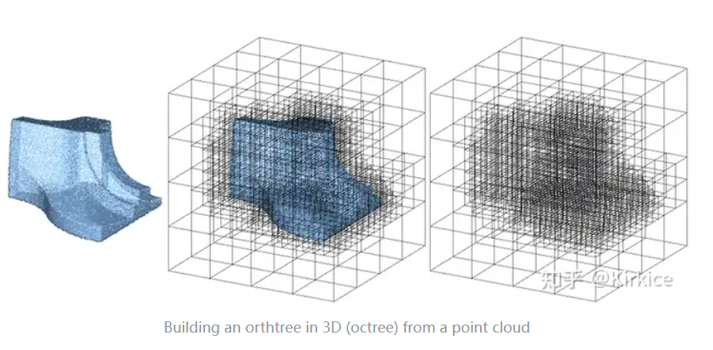
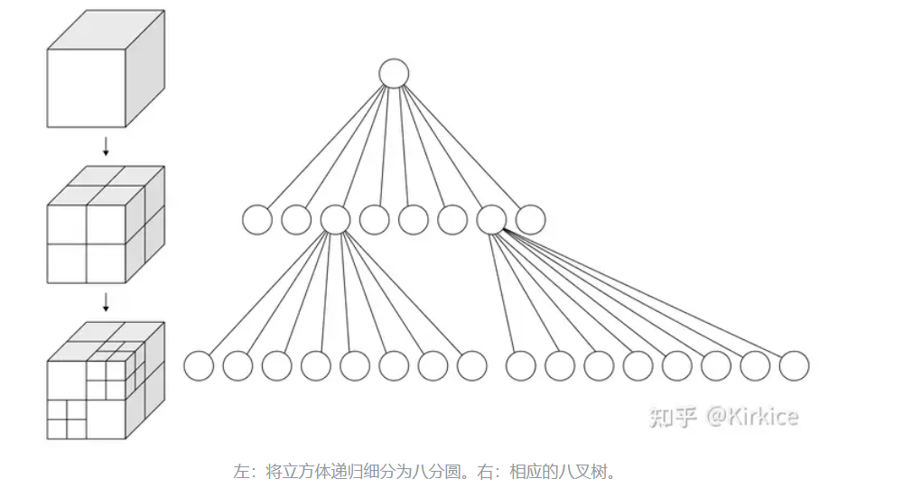
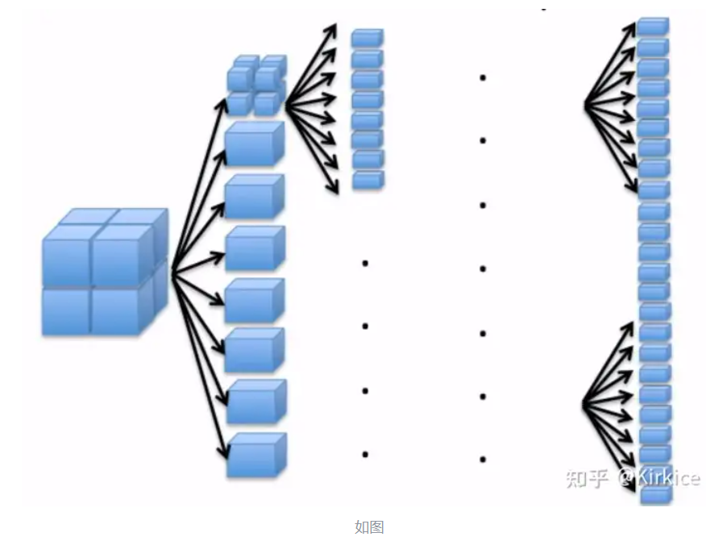

# 八叉树

## 1.定义和介绍

八叉树（Octree）是一种用于描述三维空间的树状数据结构。八叉树的每个节点表示一个正方体的体积元素，每个节点有八个子节点，将八个子节点所表示的体积元素加在一起就等于父节点的体积。八叉树是四叉树在三维空间上的扩展，二维上我们有四个象限，而三维上，我们有8个卦限。八叉树主要用于空间划分和最近邻搜索。





## 2.实现Octree的原理

1.将当前的立方体细分为八个子立方体。

2.如果任何一个子立方体内包含多个点，则将其进一步细分为八个子立方体。

3.重复以上操作使得每个子立方体内包含最多一个点。



如果 𝑆 是每个维度中的点数，那么在八叉树中形成的结点数为 
$$
\frac{S^3 - 1}{7}
$$

## 3.Python实现八叉树

**Open3D**的几何类型**Octree**，可用于创建，搜索和遍历具有用户指定的最大树深度**max_depth**的八叉树。

### 3.1 从点云中构造八叉树

可以使用convert_from_point_cloud方法从点云中构造八叉树。通过沿着从根节点到深度max_depth处的相应叶节点的路径将每个点插入到树中。 随着树的深度增加，内部（最终是叶子）节点表示3D空间的较小划分。

如果点云具有颜色，则相应的叶节点采用最后插入的点的颜色。 size_expand参数增加了根八叉树节点的大小，因此它比原始点云边界稍大以容纳所有点。

```python
# -*- coding: UTF-8 -*-
import numpy as np
import open3d as o3d
import Open3D.examples.python.open3d_tutorial as o3dtut
 
# 加载点云，并采样2000个点
N = 2000
pcd = o3dtut.get_armadillo_mesh().sample_points_poisson_disk(N)
# 点云归一化
pcd.scale(1 / np.max(pcd.get_max_bound() - pcd.get_min_bound()),
          center=pcd.get_center())
# 点云着色
pcd.colors = o3d.utility.Vector3dVector(np.random.uniform(0, 1, size=(N, 3)))
# 可视化
o3d.visualization.draw_geometries([pcd])
 
# 创建八叉树， 树深为4
octree = o3d.geometry.Octree(max_depth=4)
# 从点云中构建八叉树，适当扩展边界0.01m
octree.convert_from_point_cloud(pcd, size_expand=0.01)
# 可视化
o3d.visualization.draw_geometries([octree])
```

### 3.2 从体素网格中构造八叉树

也可以使用**create_from_voxel_grid**方法从**Open3D**的**VoxelGrid**几何结构中构造八叉树。 输入**VoxelGrid**的每个体素都被视为**3D**空间中的一个点，其坐标对应于该体素的原点。 每个叶节点都采用其相应体素的颜色。

```python
# 从点云中创建体素网格， 体素大小为0.05m
voxel_grid = o3d.geometry.VoxelGrid.create_from_point_cloud(pcd, voxel_size=0.05)
# 体素可视化
o3d.visualization.draw_geometries([voxel_grid])
 
# 创建八叉树， 树深为4
octree = o3d.geometry.Octree(max_depth=4)
# 从体素网格中构建八叉树
octree.create_from_voxel_grid(voxel_grid)
# 可视化
o3d.visualization.draw_geometries([octree])
```

另外，可使用**to_voxel_grid**将**Octree**转变为**VoxelGrid**。

### 3.3 遍历八叉树

可以遍历八叉树，这对于搜索或处理**3D**几何体的子部分很有用。通过向**traverse**方法提供回调，每次访问节点（内部或叶）时，都可以执行额外的处理。

在下面的示例中，提前停止标准仅用于处理具有超过特定点数的内部/叶节点。这种提前停止能力可以有效地处理满足一定条件的空间区域。

```python
def f_traverse(node, node_info):
    early_stop = False

    if isinstance(node, o3d.geometry.OctreeInternalNode):
        if isinstance(node, o3d.geometry.OctreeInternalPointNode):
            n = 0
            for child in node.children:
                if child is not None:
                    n += 1
            print(
                "{}{}: 内部节点在深度 {} 有 {} 个子节点和 {} 个点（起点 {}）"
                .format('    ' * node_info.depth,
                        node_info.child_index, node_info.depth, n,
                        len(node.indices), node_info.origin))

            # 我们只想处理有足够多点的节点/空间区域
            early_stop = len(node.indices) < 250
    elif isinstance(node, o3d.geometry.OctreeLeafNode):
        if isinstance(node, o3d.geometry.OctreePointColorLeafNode):
            print("{}{}: 叶子节点在深度 {} 有 {} 个点，起点为 {}".
                  format('    ' * node_info.depth, node_info.child_index,
                         node_info.depth, len(node.indices), node_info.origin))
    else:
        raise NotImplementedError('未识别的节点类型！')

    # 提前停止遍历：如果为真，则跳过当前节点的子节点遍历
    return early_stop

 
# 创建八叉树， 树深为4
octree = o3d.geometry.Octree(max_depth=4)
# 从点云中创建体素网格， 体素大小为0.01m
octree.convert_from_point_cloud(pcd, size_expand=0.01)
# 遍历
octree.traverse(f_traverse)

```

### 3.4 查找包含点的叶节点

使用上述遍历机制，可以快速地在八叉树中搜索包含给定点的叶节点。 通过**locate_leaf_node**方法提供此功能。

```python
octree.locate_leaf_node(pcd.points[0])
```

